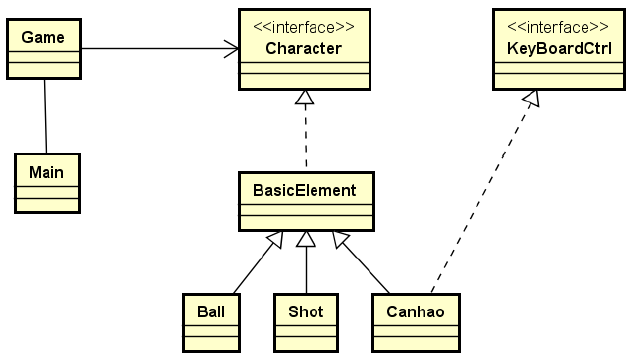

**Bacharelado em Ciência da Computação
Programação Orientada a Objetos
Professores: Bernardo Copstein e Isabel H. Manssour**

# Trabalho Final

**Objetivos** : o objetivo deste trabalho é demonstrar domínio dos conceitos básicos de programação
orientada a objetos em especial herança e polimorfismo, especificação da interface das classes usando
JML, conhecimento básico de padrões de projeto, criação de interface com o usuário rica usando JavaFX e
uso de frameworks.

**Tema do trabalho:** o trabalho deverá implementar um jogo ao estilo “Space Invaders” a partir do
framework fornecido pelo(a) professor(a). Este framework constitui-se de uma série de classes e interfaces
detalhadas na sequência (ver figura 1) a partir das quais deverão ser derivados os personagens e as regras
de funcionamento do jogo.

>
>
Figura 1 – Diagrama de classes do framework

O jogo consiste de uma série de personagens animados (os invasores) que descem em direção a parte de
baixo da tela através de movimentos próprios. O objetivo do jogador é controlar um canhão que se
movimenta para a direita ou esquerda na parte de baixo da tela e que é capaz de atirar para eliminar os
invasores. Na medida em que os invasores são eliminados o jogador acumula pontos. O jogo só acaba se
algum invasor atinge a parte de baixo da tela ou se o canhão é destruído (eventualmente os invasores
também atiram em direção ao canhão).

### I. Regras para a implementação:

- Devem existir diferentes tipos de personagens que são representados por uma hierarquia
de herança. Cada tipo de personagem tem uma aparência e um comportamento
diferente. Por exemplo, alguns apenas se movimentam lentamente da esquerda para a
direita e da direita para a esquerda, e sempre que chegam numa extremidade eles
descem. Alguns podem ter um movimento semelhante, mas também podem atirar.
Outros também podem ser mais difíceis de eliminar, necessitando receber dois ou mais
tiros para serem eliminados. Por fim pelo menos um dos tipos deve prever
comportamento de grupo.

- Devem ser explorados os padrões de projeto “singleton”, “factory” e “composite” (para
comportamentos de grupo).

- Os personagens devem, obrigatoriamente, serem derivados das classes fornecidas
explorando adequadamente os conceitos de programação orientada a objetos.

- A interface com o usuário deve ser aprimorada usando JavaFX (contagem de pontos, início
e suspensão do jogo, configurações, etc.).

- Os métodos que definem o comportamento dos personagens devem ser anotados com
JML. Deve ser implementado um pequeno “driver” de teste capaz de demonstrar que
violações às especificações são detectáveis pelo JML.

- O jogo deve ser capaz de manter a relação das 10 melhores pontuações em arquivo.

### II. Restrições no jogo:

- Devem existir pelo menos 4 tipos de invasores diferentes.

- Pelo menos um dos tipos de invasores deve ser capaz de atirar contra o canhão.

- Pelo menos um dos tipos de invasores deve prever comportamento de grupo.

- O objetivo do jogo deve ser eliminar todos os invasores antes que eles cheguem na parte
de baixo da tela.

- Conforme o usuário elimina invasores, novos tipos invasores vão surgindo. A cada nova
“fase”, ou seja, quando surgem novos invasores, a velocidade deles deve aumentar, de
maneira a aumentar complexidade do jogo. Cada invasor eliminado pontua conforme seu
tipo.

- A implementação deve ser capaz de detectar o final do jogo: ou um invasor chega na parte
de baixo da tela ou o canhão é destruído. O objetivo é fazer o maior número de pontos
antes que o jogo acabe.

### III. Código fornecido:
- O código fonte fornecido reflete o diagrama de classes da figura 1. A versão atual
implementa um sistema que demonstra o uso das classes, mas não uma versão limitada
do jogo.

### Entrega:

- O trabalho deve ser feito em dupla ou individualmente até a data especificada.
  
- Cada aluno ou dupla deverá entregar no Moodle um arquivo zip contendo a implementação feita
  (todas as pastas e os arquivos .java). Este arquivo deve ter o nome e sobrenome do(s) aluno(s), da
  seguinte forma: nome_ultimosobrenome-nome_ultimosobrenome.zip. Deve ser feito o upload
  deste arquivo na tarefa indicada para isto no Moodle até a data e horário especificados.
  
- Os trabalhos não podem apresentar erros de compilação e as soluções de cada aluno ou dupla
  devem ser originais.

